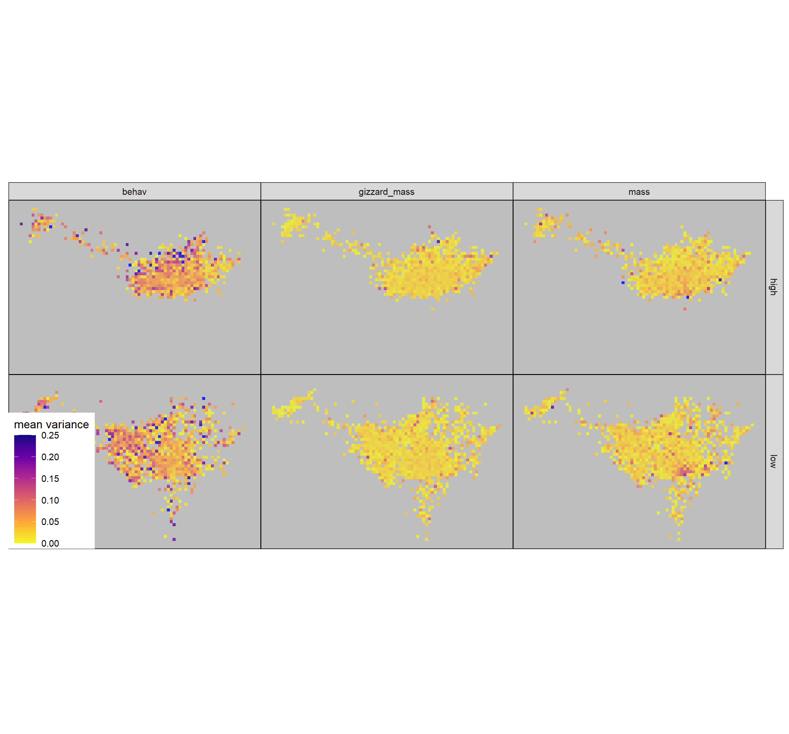

# Finding flocks among red knot residence patches

```{r}
library(tidyverse)
library(igraph)
```

## Read in patch data

```{r}
# read in overlap data
data <- read_csv("data/data2018/data_spatio_temporal_overlap_2018.csv")
data_patches <- read_csv("data/data2018/data_2018_patch_summary_has_patches.csv") %>% 
  mutate(uid = as.character(1:nrow(.)))
```

## Find flocks

```{r}
# find modules in an undirected binary network
edge_df <- select(data, contains("id"))

# make a global network
patch_network <- graph_from_edgelist(edge_df %>% 
                                       as.matrix(), 
                                     directed = FALSE)
# find modules
flocks <- igraph::cluster_fast_greedy(patch_network)

# assign modules to flock
flocks <- communities(flocks) %>% 
  imap(function(.x, .y) {
    tibble(flock = .y,
           patch_uid = .x)
  })

# remove flocks of size 1
flocks <- keep(flocks, function(x) { nrow(x) > 1 })
```

The majority of 'flocks' have only 1 patch -- nearly `r 40000 - 8045` of them.
These are removed.

## Assign flocks to patch data

```{r}
# bind rows and remove duplicates
flocks <- bind_rows(flocks) %>% 
  map_dfc(as.character)

# there are no duplicates
data_patches <- data_patches %>% 
  left_join(flocks, 
            by = c("uid" = "patch_uid"))
```

## Unique individuals in flocks

```{r}
# get unique id per flocks
flocks <- data_patches %>% 
  distinct(flock, id) %>% 
  drop_na() %>% 
  map_dfc(as.character)
```

## Traits in flocks

### Read in trait data

```{r}
# make nodes data -- this the individual identities
# add individual data to patch data
data_id <- readxl::read_excel("data/data2018/Biometrics_2018-2019.xlsx") %>% 
  filter(str_detect(`TAG NR`, "[a-zA-Z]+", negate = TRUE),
         Nioz == "No")

# a function for gizzard mass
get_gizzard_mass <- function(x, y) {
  -1.09 + (3.78 * (x * y))
}

# add gizzard mass
data_id <- mutate(data_id,
                  gizzard_mass = get_gizzard_mass(SH1, SW1))

# rename columns and drop ids without mass and gizzard mass
data_id <- data_id %>% 
  select(id = `TAG NR`, 
         month = CATCH_MONTH,
         wing = WING, mass = MASS,
         bill_length = BILL,
         gizzard_mass) %>% 
  distinct(id, .keep_all = TRUE) %>% 
  drop_na(gizzard_mass)

# add some exploration scores and tag info
data_behav <- read_csv("data/data2018/2018-19-all_exploration_scores.csv") %>% 
  filter(Exp == "F01")
data_tag <- read_csv("data/data2018/tag_info.csv") %>% 
  mutate(id = as.character(Toa_Tag))

# join all scores
data_id <- left_join(data_id, data_tag,
                     by = c("id")) %>% 
  left_join(data_behav, by = "FB")

# remove ids with no exploration
data_id <- mutate(data_id,
                  behav = Mean) %>% 
  # drop_na(behav) %>% 
  select(id, mass, wing, bill_length, gizzard_mass, behav, month)
```

### Centre trait data on release month mean

```{r}
# centre on release month mean, first pviot
data_id <- data_id %>% 
  pivot_longer(cols = c("mass", "gizzard_mass", "behav",
                        "bill_length", "wing"),
               names_to = "trait",
               values_to = "trait_value")
  
# now group and centre and scale
data_id <- data_id %>% 
  group_by(month, trait) %>% 
  mutate(trait_value = trait_value - mean(trait_value, na.rm = TRUE),
         trait_value = scales::rescale(trait_value))
```

## Within flock trait variance

```{r}
# link id flock traits
flocks <- left_join(flocks, data_id)

# remove bad data
flocks <- drop_na(flocks)

# get within flock variance in traits
flock_variances <- flocks %>% 
  group_by(flock, trait) %>% 
  summarise(trait_sd = sd(trait_value, na.rm = TRUE))
```

## Add fixed predictors

```{r}
# get some flock covariates
flock_covariates <- data_patches %>% 
  group_by(flock) %>% 
  summarise_at(vars("waterlevel_mean", "tidaltime_mean",
                    "x_mean", "y_mean", "tide_number"),
               list(mean))

# get flock size
flock_size <- data_patches %>% 
  distinct(id, flock) %>% 
  count(flock, name = "flock_size") %>% 
  drop_na()

# add flock size to covariate
flock_covariates <- flock_covariates %>% 
  left_join(flock_size) %>% 
  mutate(tide_number = as.character(round(tide_number)))
```

## Plot flock size vs covariates

```{r}
# basic plot
ggplot(flock_covariates)+
  stat_smooth(aes(tidaltime_mean, flock_size,
                  group = tide_number),
              size = 0.1, alpha = 0.2,
              col = "lightblue",
              show.legend = F,
              se = F) +
  stat_smooth(aes(tidaltime_mean, flock_size),
              alpha = 0.2,
              show.legend = F,
              col = "red",
              se = T) +
  scale_x_continuous(labels = scales::comma_format(suffix = " min\nafter HT"))
```

## Incoming and outgoing tide

```{r}
# assign incoming or outgoing tide based on time since high tide
flock_covariates <- flock_covariates %>% 
  mutate(tide_stage = if_else(waterlevel_mean < 55, "low", "high"),
         tide_phase = if_else(tidaltime_mean < 360, "ebb", "flow"))
```

## Within flock variance model

How does within flock variance change over a tidal cycle?

### Add covariates to flock variance

```{r}
# add flocks and flock_variances
flock_variances <- flock_variances %>% 
  left_join(flock_covariates)
```

### Plot variance in space and time

```{r}
ggplot(flock_variances) +
  geom_histogram(aes(trait_sd)) +
  facet_grid( ~ trait, switch = "both")

ggplot(data_id)+
  geom_histogram(aes(sqrt(trait_value)))+
  facet_grid(~ trait)
```

```{r}
ggplot(flock_variances %>% 
         drop_na(trait_sd))+
  geom_point(aes(x_mean, y_mean,
                col = trait_sd),
             alpha = 0.2,
             shape = 16)+
  scale_colour_viridis_c(option = "C",
                       direction = -1,
                       # limits = c(0, 0.25),
                       name = "mean sd",
                       na.value = "blue")+
  facet_grid(tide_stage ~ trait,
             labeller = label_both) +
  # coord_sf(crs = 32631) +
  ggthemes::theme_map() +
  theme(panel.background = element_rect(fill = "white"))

ggsave("figs/fig_within_flock_sd.png",
       dpi = 300,
       width = 12, height = 5)
```

```{r eval=TRUE}

```

## Model within flock variance

WIP

---

