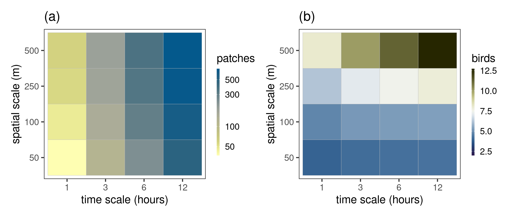
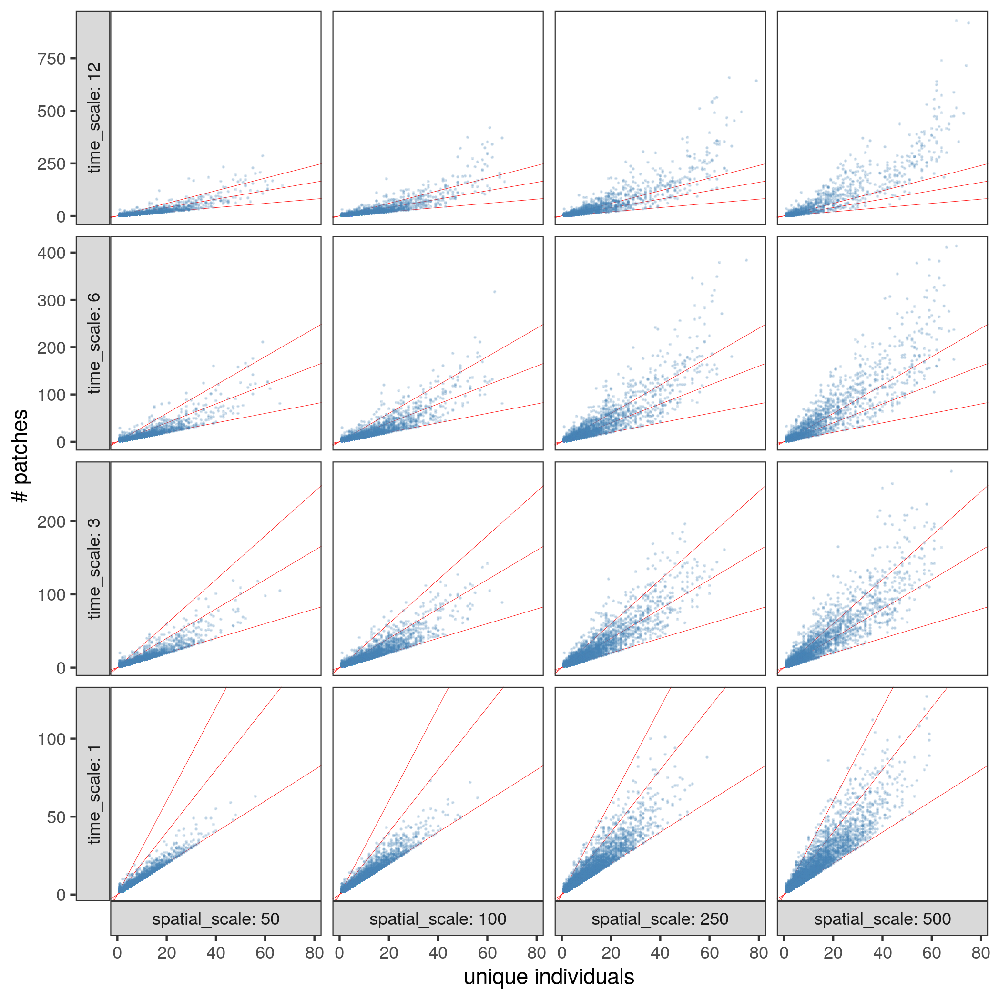
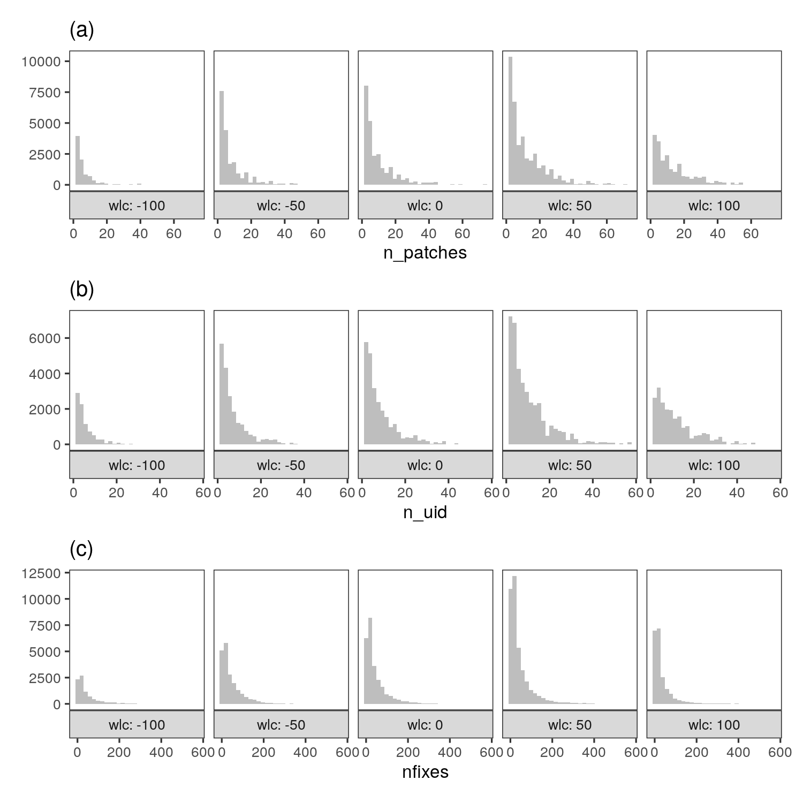

# Basic cluster description

## Prepare libraries

```{r prep_libs_07, eval=FALSE}
library(tidyverse)
# for plots
library(ggplot2)
library(scico)

# ci function
ci <- function(x){qnorm(0.975)*sd(x, na.rm = TRUE)/sqrt(length(x))}
```

## Read in data

```{r read_modules_07, eval=FALSE}
# read in data
modules <- read_csv("data/data_2018_patch_modules_small_scale.csv")
```

## Summarise patches per module

```{r summarise_data, eval=FALSE}
# count modules at each scale and plot
module_per_scale <- modules %>% 
  group_by(time_scale, spatial_scale, time_chunk) %>% 
  summarise_at(vars(module),
               list(~length(.))) %>% 
  group_by(time_scale, spatial_scale) %>% 
  summarise(mean_n_modules = mean(module))

fig_modules_scale <-
ggplot(module_per_scale)+
  geom_tile(aes(factor(time_scale), factor(spatial_scale), 
                fill = mean_n_modules), col = "grey")+
  scale_fill_scico(palette = "nuuk",
                   # limits = c(NA, 1000),
                   direction = -1,
                   trans = "log10")+
  theme_test()+
  theme(legend.key.width = unit(0.1, "cm"))+
  labs(x = "time scale (hours)", y = "spatial scale (m)",
       fill = "patches", title = "(a)")
```

## Summarise birds per module

How many ids in each scale, on average?

```{r summarise_by_id, eval=FALSE}
# count unique individuals per time chunk per module per scale
id_per_scale <- modules %>% 
  group_by(time_scale, spatial_scale, time_chunk, module) %>% 
  summarise(unique_id = length(unique(id))) %>% 
  group_by(time_scale, spatial_scale) %>% 
  summarise(mean_uid = mean(unique_id))

fig_id_scale <- 
ggplot(id_per_scale)+
  geom_tile(aes(factor(time_scale), factor(spatial_scale), 
                fill = mean_uid), col = "grey")+
  scale_fill_scico(palette = "broc",
                   limits = c(2, NA),
                   na.value = "grey",
                   direction = 1)+
  theme_test()+
  theme(legend.key.width = unit(0.1, "cm"))+
  labs(x = "time scale (hours)", y = "spatial scale (m)",
       fill = "birds", title = "(b)")
```

```{r save_fig_scale, eval=FALSE}
# make patchwork and export
fig_scales <- patchwork::wrap_plots(fig_modules_scale, fig_id_scale)
ggsave(fig_scales, filename = "figs/fig_modules_scale_small.png", 
       dpi = 300, height = 3, width = 7)
```

```{r include_fig_scales, eval=TRUE}

```

## Does number of patches scale with individuals in module?

```{r patch_size_module_size, eval=FALSE}
# get module size at each scale
patch_per_mod <- modules %>% 
  group_by(time_scale, spatial_scale, time_chunk, module) %>% 
  summarise(n_patches = length(patch),
            n_uid = length(unique(id))) 

fig_patches_id <- ggplot(patch_per_mod)+
  geom_abline(slope = c(1,2,3), 
              col = c("red"),
              size = 0.1)+
  geom_point(aes(n_uid, n_patches), 
             size = 0.1, alpha = 0.2,
             col = "steelblue")+
  theme_test()+
  facet_grid(time_scale~spatial_scale,
             labeller = label_both,
             scales = "free_y",
             as.table = FALSE,
             switch = "both")+
  labs(x = "unique individuals",
       y = "# patches")

# save figure
ggsave(fig_patches_id, filename = "figs/fig_patches_id.png",
       dpi = 300)
```

```{r}

```

## Module metrics and composition ~ waterlevel

How does the number of patches and number of ids and number of fixes change with waterlevel?

```{r module_size_waterlevel, eval=FALSE}
# add patch data to get waterlevel
data <- read_csv("data/data_2018_patch_summary.csv")
modules <- inner_join(modules, data)

# add rounded waterlevel
mods_waterlevel <- modules %>% 
  select(spatial_scale, time_scale, time_chunk,
         module, id, waterlevel_start) %>% 
  mutate(wlc = plyr::round_any(waterlevel_start, 50))

# get summary data by scale, time chunk, and waterlevel
mods_waterlevel <- mods_waterlevel %>% 
  group_by(spatial_scale, time_scale, time_chunk, wlc) %>% 
  summarise(n_patches = length(module), 
            n_clusters = length(unique(module)),
            n_uid = length(unique(id))) %>% 
  pivot_longer(cols = c("n_patches", "n_uid", "n_clusters")) %>% 
  split(.$name)

# svae fig
list_plot <- map2(mods_waterlevel, letters[1:3], 
                  function(df, title){
  ggplot(df,
         aes(value))+
  geom_histogram(fill = "steelblue")+
  # geom_pointrange(size = 0.2, col = "steelblue")+
  theme_test(base_size = 8)+
  facet_grid(~wlc,
             scales = "free_y",
             as.table = F,
             switch = "both",
             labeller = label_both)+
  # xlim(0, 20)+
  labs(x = glue::glue('{unique(df$name)}'),
       y = NULL,
       title = glue::glue('({title})'))})

fig_mods_waterlevel <- patchwork::wrap_plots(list_plot, ncol = 1)

ggsave(fig_mods_waterlevel, 
       filename = "figs/fig_mods_waterlevel.png",
       device = png(), dpi = 300, height = 5, width = 5)
```

```{r}

```
