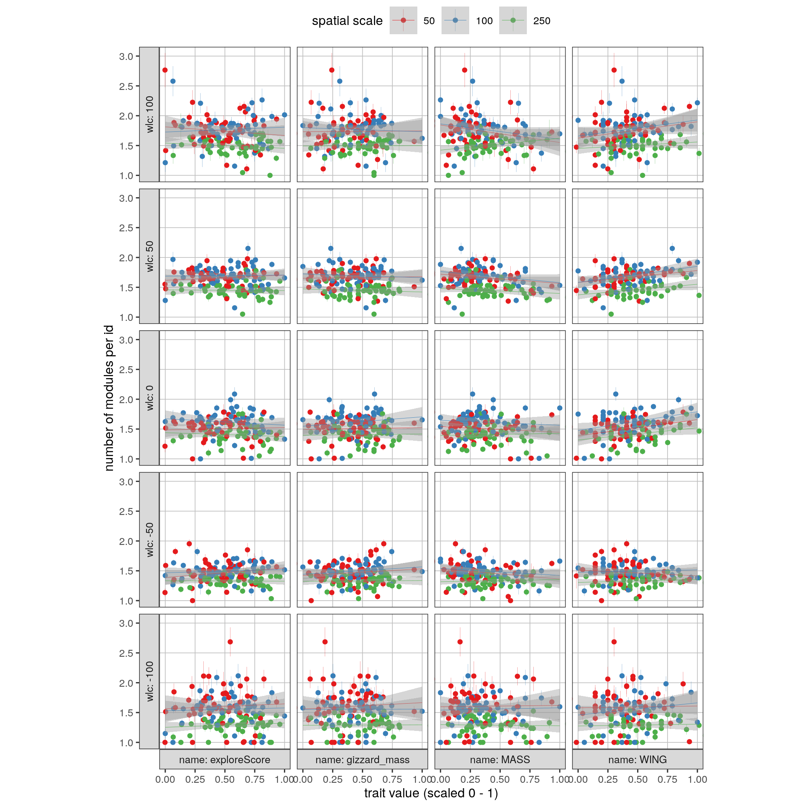
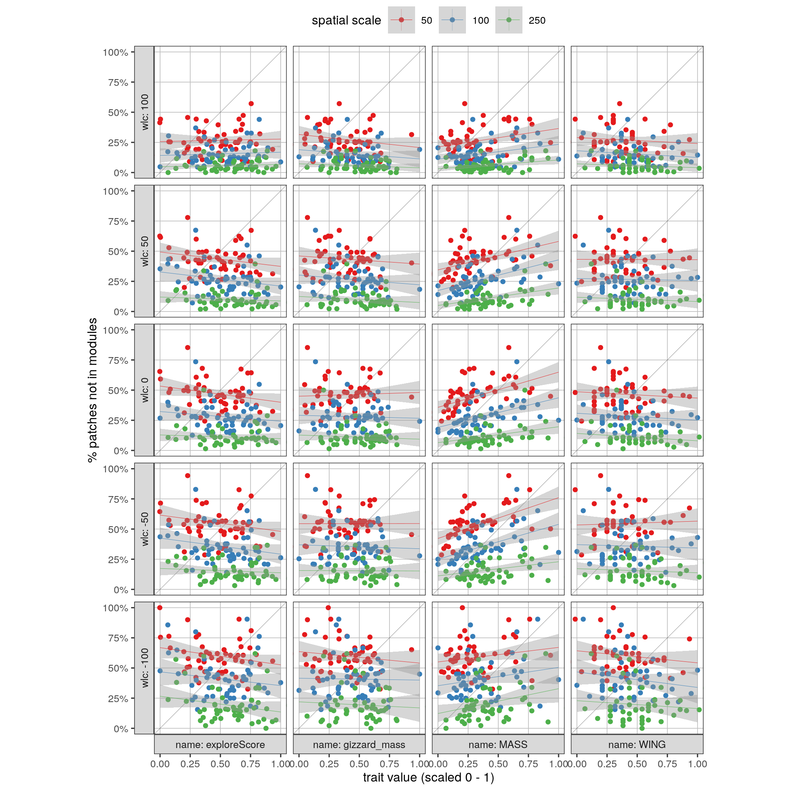

---
editor_options:
  chunk_output_type: console
---

# Individual traits and presence in modules

## Prepare libraries

```{r prep_libs_04, eval=FALSE}
library(tidyverse)

# for plots
library(ggplot2)
library(plotly)
library(htmlwidgets)

# ci function
ci <- function(x){qnorm(0.975)*sd(x, na.rm = TRUE)/sqrt(length(x))}
```

## Read in module data

```{r read_modules_02, eval=FALSE}
# read in data
modules <- read_csv("data/data_2018_patch_modules_small_scale.csv")
data <- read_csv("data/data_2018_good_patches.csv")
```

Choose three spatial scales and one temporal scale.

```{r choose_scale_2, eval=FALSE}
modules <- filter(modules, time_scale %in% c(1), spatial_scale <= 250)
```

## Visualise modules

```{r vis_modules, eval=FALSE}
# get mean and ci for patches
mod_data <- modules %>% 
  inner_join(data)

# count unique ids in each mod-time-chunk and filter on 2
mod_data <- mod_data %>% 
  group_by(spatial_scale, module, time_chunk) %>% 
  mutate(xc = mean(x_mean, na.rm = T),
         yc = mean(y_mean, na.rm = T),
         wlc = mean(waterlevel_start),
         wlc = plyr::round_any(wlc, 50),
         n_uid = length(unique(id)),
         n_patches = length(unique(x_mean)))

# select single time chunk
a = ggplot()+
  geom_point(data = mod_data %>%
               filter(between(time_chunk, 700, 750)) %>%
               distinct(x_mean, y_mean, .keep_all = T),
             aes(x_mean, y_mean,
                 # fill = duration,
                 # col = factor(spatial_scale),
                 size = area),
             shape = 1,
             col = "grey20",
             alpha = 0.5,
             stroke = 0.15)+
  geom_segment(data = mod_data %>% 
                 filter(between(time_chunk, 700, 750)),
               aes(x_mean, y_mean,
                   xend = xc, yend = yc,
                   col = factor(spatial_scale)),
               size = 0.2,
               alpha = 0.8,
               show.legend = FALSE)+
  # scale_fill_distiller(palette = "Reds")+
  scale_colour_brewer(palette = "Set1")+
  coord_sf(crs = 32631)+
  # facet_wrap(~time_chunk)+
  theme(axis.text = element_blank())


figplotly <- ggplotly(a)

saveWidget(figplotly, file = "fig_modules.html")
```

## Count unique modules per individual

```{r, eval=FALSE}
# get modules per id over the tidal cycle
modules_per_id <- inner_join(modules, data)

# get mean waterlevel_start per module
wlc_per_time_chunk <- modules_per_id %>% 
  group_by(spatial_scale, module, time_chunk) %>% 
  summarise(wlc = plyr::round_any(mean(waterlevel_start), 50))

# count modules per id
modules_per_id <- modules %>%
  group_by(id, spatial_scale, time_chunk) %>% 
  summarise(n_modules = length(unique(module)))

# add wlc to the timechunk
modules_per_id <- left_join(modules_per_id, wlc_per_time_chunk)

# get mean and ci modules per id
modules_per_id <- modules_per_id %>% 
  group_by(id, spatial_scale, wlc) %>% 
  summarise_at(vars(n_modules), list(mean=mean, ci=ci))
```

## Link modules to individual data

```{r, eval=FALSE}
# load physio data
tag_data <- read_csv("data/data_2018_behav.csv")
modules_per_id <- left_join(modules_per_id, tag_data, by = "id")
modules_per_id <- filter(modules_per_id, !is.na(exploreScore))

# exclude extreme birds
quantile(tag_data$exploreScore, probs = c(0.05, 0.95), na.rm = T)

modules_per_id <- filter(modules_per_id, between(exploreScore, -0.18, 0.74))
```

Select some possible predictors

```{r, eval=FALSE}
modules_per_id <- modules_per_id %>% 
  select(spatial_scale, wlc, mean, ci, WING, MASS, gizzard_mass, exploreScore) %>%
  pivot_longer(cols = c("WING", "MASS", "gizzard_mass", "exploreScore"))

modules_per_id <- group_by(modules_per_id, name) %>% 
  mutate(value = scales::rescale(value))
```

```{r fig_mods_per_trait, eval=FALSE}
# plot figure
fig_mods_per_trait <-
  ggplot(modules_per_id,
         aes(value, mean, 
             ymin = mean-ci, ymax = mean+ci,
             col = factor(spatial_scale)))+
  facet_grid(wlc~name, #xscales = "free_x",
             switch = "both", as.table = F, 
             labeller = label_both)+
  geom_pointrange(size = 0.05, position = position_dodge(width = 0.2))+
  geom_smooth(method = "glm", size = 0.1)+
  scale_colour_brewer(palette = "Set1")+
  coord_equal(ratio = 0.5, xlim = c(0,1))+
  labs(x = "trait value (scaled 0 - 1)",
       y = "number of modules per id",
       colour = "spatial scale")+
  theme_test(base_size = 8)+
  theme(legend.position = "top",
        panel.grid.major = element_line(size = 0.2,
                                  colour = "grey"))

# save figure
ggsave(fig_mods_per_trait, filename = "figs/fig_mods_per_trait.png")
```

```{r}

```

## Add patch data

```{r add_patch_data2, eval=FALSE}
# split data by spatial scale
mod_data <- split(modules, modules$spatial_scale)

# add patch data at each scale
mod_data <- map(mod_data, function(df){
  full_join(df, data)
})

# within each scale count patches with no module
mod_data_indep <- map(mod_data, function(df){
  
  # identify waterlevel in 50cm increments
  df <- mutate(df, wlc = plyr::round_any(waterlevel_start, 50))
  
  df <- group_by(df, id, wlc) %>% 
    summarise(indep_patches = sum(is.na(spatial_scale)),
              p_indep_patches = indep_patches/length(patch)) %>% 
    group_by(id, wlc) %>%
    summarise_at(vars(p_indep_patches), list(mean_indep=mean, ci=ci))
})

# add spatial scale
mod_data_indep <- imap(mod_data_indep, ~ mutate(.x, spatial_scale = .y)) %>% 
  bind_rows()
```

## Link independent patches to traits

```{r indep_patches_per_trait, eval=FALSE}
mod_data_indep <- left_join(mod_data_indep, tag_data, by = "id")
mod_data_indep <- filter(mod_data_indep, !is.na(exploreScore))

# exclude extreme birds
quantile(tag_data$exploreScore, probs = c(0.05, 0.95), na.rm = T)
mod_data_indep <- filter(mod_data_indep, between(exploreScore, -0.18, 0.74))

# melt data
mod_data_indep <- select(mod_data_indep, spatial_scale, wlc, 
                         mean_indep, ci, 
                         WING, MASS, gizzard_mass, exploreScore) %>%
  pivot_longer(cols = c("WING", "MASS", "gizzard_mass", "exploreScore"))
```

```{r, eval=FALSE}
# make factor of spatial scale
mod_data_indep$spatial_scale <- as_factor(mod_data_indep$spatial_scale)

mod_data_indep <- group_by(mod_data_indep, name) %>% 
  mutate(value = scales::rescale(value))

fig_indep_patches <- ggplot(mod_data_indep,
       aes(value, mean_indep, 
           ymin = mean_indep-ci, ymax = mean_indep+ci,
           col = factor(spatial_scale)))+
  geom_abline(slope = 1, col = "black", 
              alpha = 0.5, size = 0.1)+
  # geom_hline(yintercept = 0.5, col = "black", 
  #             alpha = 0.5, size = 0.2)+
  facet_grid(wlc~name,# scales = "free_x",
             as.table = F, switch = "both",
             labeller = label_both)+
  geom_pointrange(size = 0.05, position = position_dodge(width = 0.2))+
  geom_smooth(method = "glm", size = 0.1)+

  scale_y_continuous(labels = scales::percent)+
  scale_colour_brewer(palette = "Set1")+
  coord_equal(xlim=c(0,1))+
  labs(x = "trait value (scaled 0 - 1)",
       y = "% patches not in modules",
       colour = "spatial scale")+
  theme_test(base_size = 8)+
  theme(legend.position = "top",
        panel.grid.major = element_line(size = 0.2,
                                  colour = "grey"))


ggsave(fig_indep_patches, filename = "figs/fig_indep_patches.png")
```

```{r eval=FALSE}

```