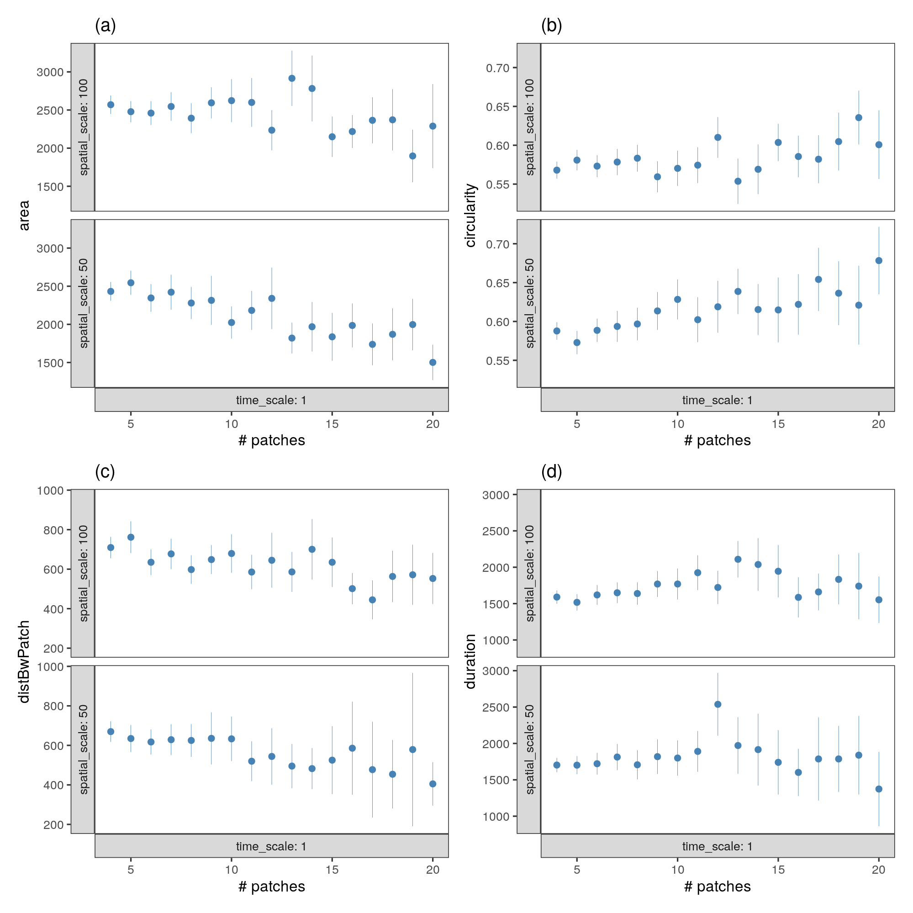

# Patch metrics in relation to module size

## Prepare libraries

```{r prep_libs_03, eval=FALSE}
library(tidyverse)

# for plots
library(ggplot2)
library(plotly)
library(htmlwidgets)


# ci function
ci <- function(x){qnorm(0.975)*sd(x, na.rm = TRUE)/sqrt(length(x))}
```

## Read in module data

```{r read_modules, eval=FALSE}
# read in data
modules <- read_csv("data/data_2018_patch_modules_small_scale.csv")
data <- read_csv("data/data_2018_good_patches.csv")
```

Choose the smallest spatial scale.

```{r choose_scale, eval=FALSE}
modules <- filter(modules, spatial_scale <= 50, time_scale == 1)
```

## Add patch data

```{r add_patch_data, eval=FALSE}
# get mean and ci for patches
mod_data <- modules %>% 
  inner_join(data)

# count unique ids in each mod-time-chunk and filter on 2
mod_data <- mod_data %>% 
  group_by(spatial_scale, module, time_chunk) %>% 
  mutate(xc = mean(x_mean, na.rm = T),
         yc = mean(y_mean, na.rm = T),
         wlc = mean(waterlevel_start),
         wlc = plyr::round_any(wlc, 25),
         n_uid = length(unique(id)),
         n_patches = length(unique(x_mean)))
```

Filter for minimum 2 indiviudals per module, and minimum of 3 patches.

```{r filter_n_id, eval=FALSE}
mod_data <- filter(mod_data, n_uid > 1, n_patches > 3)
```

## Visualise modules

```{r vis_modules, eval=FALSE}
# select single time chunk
a = ggplot(mod_data)+
  geom_segment(aes(x_mean, y_mean,
                xend = xc, yend = yc),
               size = 0.1,
               show.legend = FALSE)+
  geom_point(aes(x_mean, y_mean,
             col = time_chunk,
             fill = duration/60),
             stroke = 0.1,
             shape = 21,
             show.legend = FALSE,
             alpha = 0.2)+
  scale_colour_distiller("Greys")+
  scale_fill_distiller(palette = "YlOrRd")+
  coord_sf(crs = 32631)+
  # facet_wrap(~time_chunk)+
  theme(axis.text = element_blank())


figplotly <- ggplotly(a, tooltip = c("colour", "fill"))

saveWidget(figplotly, file = "fig_modules.html")

ggsave(a, filename = "figs/fig_modules.png", dpi = 300,
       width = 24, height = 25)
```


## Module size and composition ~ waterlevel

How does the number of patches and number of ids change with waterlevel?

```{r module_size_waterlevel, eval=FALSE}
# prep data to do stuff
mods_waterlevel <- mod_data %>% 
  ungroup() %>% 
  pivot_longer(cols = c("n_patches", "n_uid")) %>% 
  group_by(wlc, name) %>% 
  summarise_at(vars(value),
               list(~mean(., na.rm = T),
                    ~ci(.)))

# svae fig
fig_mods_waterlevel <- 
  ggplot(mods_waterlevel,
       aes(wlc, mean, 
           ymin=mean-ci, ymax=mean+ci))+
  geom_pointrange(size = 0.2, col = "steelblue")+
  theme_test()+
  facet_grid(~name, as.table = F)+
  labs(x = "waterlevel (cm NAP)",
       y = "value")

ggsave(fig_mods_waterlevel, 
       filename = "figs/fig_mods_waterlevel.png",
       device = png(), dpi = 300, height = 3, width = 5)
```

```{r}
knitr::include_graphics("figs/fig_mods_waterlevel.png")
```


## Patch size ~ number of patches in a module

```{r patch_size_module, eval=FALSE}
# count patches in module, and get mean patch area, duration, circ
# distance between patches
patch_per_mod <- modules %>% 
  group_by(time_scale, spatial_scale, time_chunk, module) %>% 
  summarise(n_patches = length(patch),
            n_uid = length(unique(id)))


# summarise data
mod_data <- mod_data %>% 
  group_by(spatial_scale, time_chunk, module) %>% 
  summarise_at(vars(area, duration, circularity, distBwPatch),
               list(~mean(., na.rm = T)))

# join with patch per mod
mod_data <- inner_join(mod_data, patch_per_mod)

# remove data above the 95% percentile
quantile(mod_data$n_patches, probs = c(0.05, 0.90))

# get by n patch
mod_summary <- mod_data %>% 
  filter(n_patches <= 20)  %>% 
  pivot_longer(cols = c("area", "duration", 
                        "circularity", "distBwPatch")) %>% 
  drop_na() %>% 
  mutate(round_n_patches = plyr::round_any(n_patches, 1)) %>% 
  group_by(time_scale, spatial_scale, round_n_patches, name) %>% 
  summarise_at(vars(value),
               list(~mean(., na.rm = T),
                    ~ci(.)))

# make list
mod_summary <- split(mod_summary, mod_summary$name)
```

```{r plot_metrics_size, eval=FALSE}
# do plot over list

list_plot <- map2(mod_summary, 
                  letters[1:4],
                  function(df, name){
  ggplot(df)+
    geom_pointrange(aes(round_n_patches, mean,
                        ymin = mean - ci, ymax = mean+ci),
                    col = "steelblue",
                    size = 0.1)+
    theme_test(base_size = 8)+
    facet_grid(spatial_scale~time_scale,
               labeller = label_both,
               # scales = "free_y",
               as.table = FALSE,
               switch = "both")+
    labs(x = "# patches",
         y = glue::glue('{unique(df$name)}'),
         title = glue::glue('({name})'))  
})

fig_metrics_social <- patchwork::wrap_plots(list_plot)

ggsave(fig_metrics_social, filename = "figs/fig_metrics_social.png",
       dpi = 300)
```

```{r}

```

