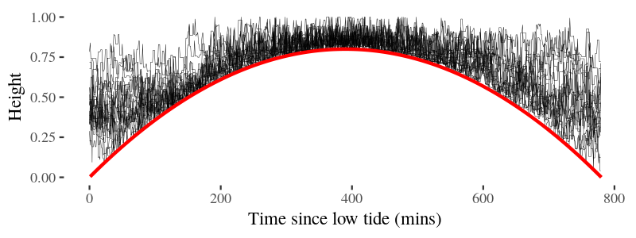

# Introduction

Wader _Charadrii_ populations are in global decline, but their ecology and evolution is not well understood at large spatio-temporal scales. Species such as red knots _Calidris canutus_ have shown surprising adapatability in the past [cite theunis and jan van gils], such as consistent individual differences ('personalities'; cite sih etc) in their exploratory behaviour [cite allert 2010?]. The ontogeny and population-level consequences of differences in exploration behaviour are unknown, but possible implications abound. For instance, studies of wader sociality assuming individuals to be identical have concluded that wader flocks follow random fission-fusion dynamics [cite dunlin and sanderling paper]. In the rare case where this assumption was untrue, correcting for non-random association was found to significantly lower estimated population sizes (by capture-mark-resighting methods) [cite knots friends paper].

The study of wader movement thus has strong impetus and is buoyed by the tide of 'movement ecology' as a field [@Nathan2008; @Jeltsch2013]. The rise in movement studies has been enabled by advances in animal tracking technologies, which provide both large scale and high resolution individual position logging [@Kays2015; @Wikelski2007a; MOTUS, ATLAS]. Animal tracking datasets frequently require novel methods to investigate questions of interest. For example, the study of sociality and information flow (social network analysis, SNA) has drawn strongly from network theory [many many damien papers]. The often opportunistic nature of collection means that comparing empirical tracking data against controls is difficult. SNA proposes the comparison of tracking data and resultant proximity based networks with null models to elucidate the phenotype-sociality relation [cite damien and orr]. However, null models have been implemented as randomisations of empirical data, or as individual based models (IBM) that do not take into account landscape level changes [cite damien and orr]. IBMs implemented in computer languages optimised for statistics such as `R` [eg. cite orr] are computationally inefficient, and poorly suited to simulating data comparable in size to empirical tracking (> 10^5^ positions per agent).

Here, I present a preliminary individual based model (IBM) of wader movement written in C++. The model aims to capture the essentials of the wader-mudflat system, such as that of red knots in the Dutch Wadden Sea [coordinates]. Here, the regular tidal cycle creates brief windows of opportunity for waders which feed on patches of buried macrozoobenthos (molluscs, worms, and arthropods). Waders locate prey in the substratum by rapidly sampling with bills that are sensitive to the pressure wave returning from buried prey, if the substrate is sufficiently waterlogged [cite]. This makes tracking the tidal waterline a sound foraging strategy, since most waders are poor swimmers. Foraging waders harvest prey and reduce their numbers, leading to declines in prey abundance from summer to winter. However, the resource landscape for waders declines only locally during summer, and may yet be renewed at each high tide by inflows of prey taxa.
The model is expected to fulfil two basic requirements:

1. Implement regular environmental change in the form of the tidal cycle, and irregular change in the food landscape due to foraging agents,
2. Implement basic patch-leaving and movement rules for agents (waders) based on internal state and environmental constraints (the tide).

The model is considered successful if agents move about the landscape while also avoiding landing in unavailable areas (flooded by the tide). ~~Further, I aim to investigate the relation between the scale of autocorrelation in the food landscape, the intrinsic expectation of landscape quality of individuals, and the total distance moved by individuals.~~

# Methods

## Generating neutral landscapes

The tidal and resource landscapes were generated in `R` [cite R] using an efficient implementation of neutral landscapes [cite sciani et al]. Both landscapes were created as Gaussian random field grids [gaussian random fields] of 10,000 cells (100 rows × 100 columns). Grid cell values ranged between 0 and 1 in each case. The maximum range of autocorrelation of the tidal landscape was set at 50 grid cells, while that of the resource landscape was varied between 2 and 25 grid cells. The mean value of the grid (`mean`), and the magnitude of variation in autocorrelation (`nug`) in each case were set at the function defaults, 0.5 and 0.2 for each parameter, respectively. Each landscape, appropriately named, was exported for use by the simulation as a `csv` file, using spaces as a delimiter.

## The `Mudflat` class

Landscape values for each cell were assigned to a corresponding object of the class `Mudflat`, a custom class created in `C++`. This class holds three `public` variables: `food`, a `double` containing the value of the resource, `height`, a `double` holding the value of the relative height of the landscape, and `open`, a `bool` determining whether the grid cell height is greater than the height of the water or not, and thus whether the grid cell is 'open' to agents. Variables were made public so as to be accessible by agents and the input reader functions. There were 10^4^ `Mudflat` objects making up the landscape matrix.

## The tidal waterline

The moving tidal waterline was simulated as a `vector` `waterHeight` of `double` values between 0 and 0.8. This cut-off at 0.8 was necessary to ensure that at the water's greatest extent, 20% of the landscape would be open for agents to occupy, preventing infinitely long land-seeking behaviour.
Since the strongest feature of the tidal landscape is its cyclicity, `waterHeight` was populated using a loop which assigned as the `i`-th element the output of a quadratic function as follows:

$y = a * (x - k)^2 + h$;

and the equation was modified for this system as:

$waterHeight[i] = -4 * {H} * (i/tidalPeriod - 0.5)^2 + H$,

where $H$ is the maximum height of water (0.8), and $tidalPeriod$ is the user-specified duration in timesteps (here, minutes) of the time between two successive low tides.
The negative value of $a$ allows for the water level to begin at its lowest (low tide; $h$ = 0.0), rise to $H$ halfway through the tidal period (high tide), and decrease again to initial values at the end of the vector.

At each timestep in a simulation (one tidal period), each grid cell's height is checked against the water height at that timestep to determine whether it is open to agents or not. Grid cells with a height ≥ 0.8 have their food values forced to 0.0 to reflect the necessity of water to the buried macrozoobenthos.

## The `Bird` class

Waders were simulated as the custom class `Bird`, containing the private variables of its gridcell coordinates `x` and `y`, the `double` values of its intrinsic expectation (`expec`), its most recently sampled value (`sample`), its current height on the tidal landscape (`height`), its 'energy' over the simulation (`totalIntake`), and the integral values of its direction of movement (`angle`) and distance of movement (`stepLength`). The public functions of the class enable initialisation at a random grid cell sampling of the resource and tidal landscape at each timestep, the update of the intrinsic expectation value after sampling, movement in case expectation is higher than the sampled value, consumption of 10% of the landscape value if the grid cell value is higher than expected, and writing the agent's position to an output file.

## `Bird` movement on the `Mudflat`

Agents of the `Bird` class are initialised at random points on the landscape, with randomly drawn values of intrinsic expectation. The ability of agents to occupy the same grid cell reflects observations that waders often forage in very close proximity, and that the spatial resolution of the empirically measured resource landscape [cite SIBES or allert] is lower than that of tracked birds. Agents then sample the food and tidal landscape, with perfect sampling and no consumption assumed. The intrinsic expectation of food value and the most recent sample are then averaged and assigned to the new intrinsic expectation, i.e., the agent weighs intrinsic and sampled values equally. If this value is higher than the sample, the agent consumes 10% of the food value of the grid cell.
If not, the agent implements a moving rule based on the difference between its updated expectation and the sample value as follows:

1. Choosing a direction: Agents choose a new direction of movement with a probability inversely proportional to the difference between expectation and sample, i.e., more dissatisfied agents are likely to continue moving in the same direction as before. Agents with a low difference are more likely to choose a random direction, which is based on an 8-level switch corresponding to the 8 direct and diagonal neighbours of a grid cell.
2. Choosing a distance: Agents choose a distance based on the difference between expected value and sampled value; this is done from an exponential distribution with a λ of $1 - difference$.

The agent's new coordinates are then calculated based on the chosen distance and direction. Moves outside the bounds of the grid are prevented by implementing periodic boundaries on all sides; the underlying logic being that the landscape is sufficiently large that movements outside the grid are movements into an adjacent grid with identical properties.

The important case in which an agent is on a grid cell that is flooded by the tide in the next timestep is handled by assigning the sampled value in this time step to 0.0, allowing the agent to implement the movement rule described above. Movement to a new grid cell which is also covered by water is handled by forcing the agent to implement the step, and then implement a new step, using the intermediate position as the starting point, until a position is chosen that is not covered by water.
It is only the final chosen position, where the agent is assumed to land, that is stored for the next timestep. This reflects the idea that waders do not necessarily keep track of, or perceive, which parts of a landscape are covered by water at all time, but rather travel to locations until a sutiable foraging site is found. Thus, agents pay a minute travel cost for all distances travelled, including the intermediate steps.

# Results

**Neutral landscapes** were generated in `R`, read into `C++`, and the values of each grid cell assigned to a `Mudflat` object using functions written for this purpose (Fig. 1).

20 agents were initialised at random locations on the grid, and implemented their behaviours. Fig. 2 represents the height of the landscape occupied by agents in a single simulation run

# Discussion

# References

\small

